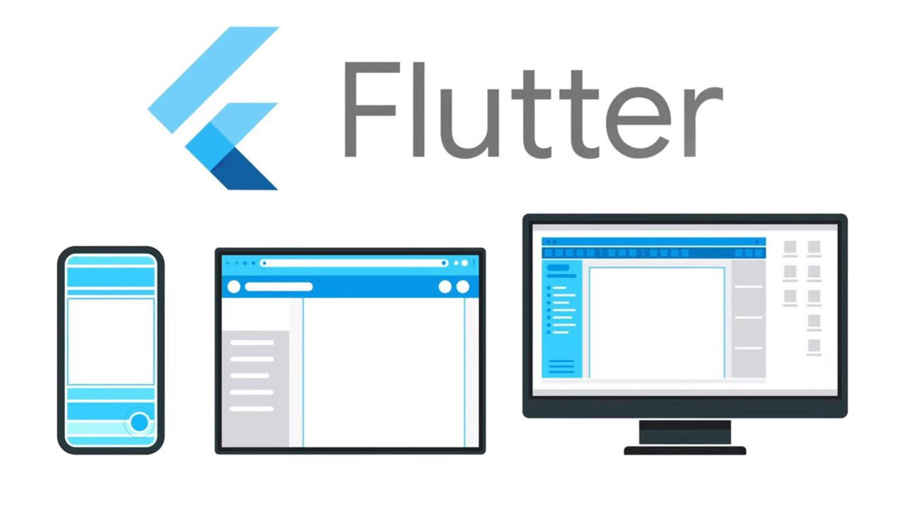
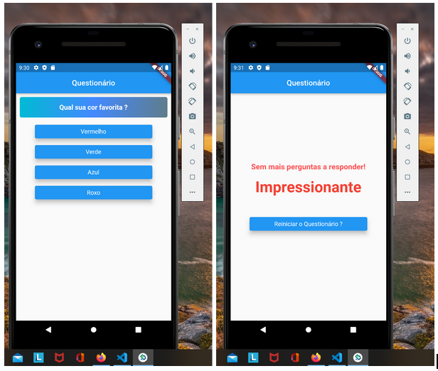

# Aplicação Questionário Avaliativo

Projeto desenvolvido em **Flutter/Dart**, cuja finalidade corresponde a um questionário, onde as perguntas são avaliadas gerando uma nota e um nível ao fim do questionário.
Vale destacar que a disposição das perguntas seque uma orde pré-definida.

## Tecnologias Utilizadas

* Flutter
* Dart
* Java
* Git

## Imagens da Aplicação

Segue abaixo algumas imagens da aplicação:

## Getting Started

This project is a starting point for a Flutter application.

A few resources to get you started if this is your first Flutter project:

- [Lab: Write your first Flutter app](https://flutter.dev/docs/get-started/codelab)
- [Cookbook: Useful Flutter samples](https://flutter.dev/docs/cookbook)

For help getting started with Flutter, view our
[online documentation](https://flutter.dev/docs), which offers tutorials,
samples, guidance on mobile development, and a full API reference.

